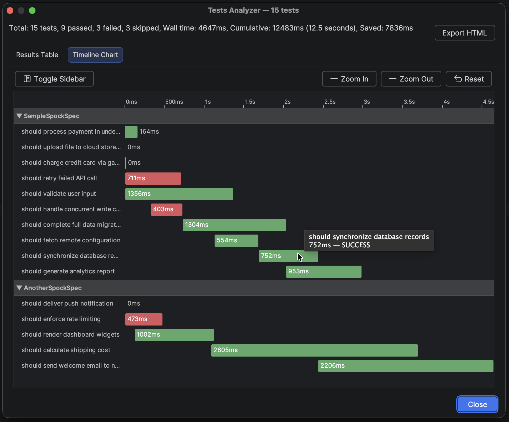
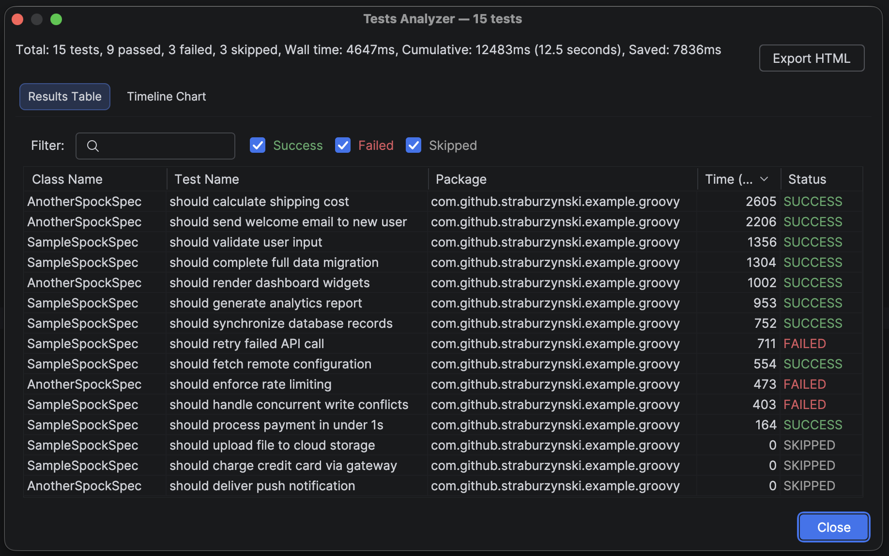
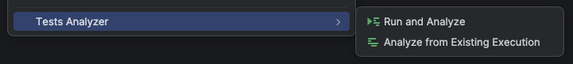

# Tests Analyzer - IntelliJ IDEA Plugin

---

## Description

An IntelliJ IDEA plugin that runs tests and visualizes their execution to help understand whether tests are running 
efficiently and uses parallelism.

## Main features

1. **Gantt Chart** — a timeline showing each test as a horizontal bar, making it immediately obvious which tests run in 
    parallel, which are sequential bottlenecks, and how total wall-clock time compares to cumulative test time.  

2. **Results Table** — a sortable, filterable table of all test results with class name, test name, duration and status.

Use it to identify slow tests, verify your parallelization configuration is working as expected, and spot opportunities
to reduce overall test suite execution time. Color coded results statuses: green = passed, red = failed, orange = skipped.




### Context menu integration

"Tests Analyzer" popup group appears when right-clicking test directories or files in the Project View, with two
actions:
- **"Run and Analyze"** — executes tests and shows results
- **"Analyze from Existing Execution"** — reads saved results from build folder without running tests



### Build systems

- **Gradle ** — automatic module and test task detection via IntelliJ's RunConfiguration API and SMTestRunner framework.
  IntelliJ's native test runner UI handles progress display during execution.
- **Maven ** — automatic detection of Maven projects; runs tests via `mvn test` and parses Surefire/Failsafe XML reports
  for results collection.

### Other features

- **HTML export** — self-contained HTML file
- **Multi-module** — automatically detects the correct Gradle module and test task
- **Popular testing frameworks** — JUnit 5, Kotest, Spock 2.x, TestNG (any framework that works with IntelliJ's test runners)
- **JSON persistence** — results are saved to `build/reports/tests-analyzer/` after execution, enabling the "Analyze
  from Existing Execution" action
- **Automatic dark/light theme support** — UI adapts to the IDE theme

---

## Usage

1. Open a Gradle or Maven-based project with tests in IntelliJ IDEA
2. In the **Project View**, right-click on a test directory or test file
3. Select **"Tests Analyzer" -> "Run and Analyze"**
4. IntelliJ's native test runner executes the tests and displays progress
5. When tests complete, a results dialog appears with two tabs:
    - **Results Table** — sortable, filterable test results with status coloring
    - **Timeline Chart** — Gantt-style visualization of test execution
6. Click **Export HTML** to save results as a standalone HTML file

To view results from a previous run without re-executing tests, use **"Tests Analyzer" -> "Analyze from Existing 
Execution"** (reads JSON from `build/reports/tests-analyzer/`).

### Configuration

Go to **Settings -> Tools -> Tests Analyzer** to configure:

- **Run tests for sub-projects** — when enabled, running tests on root test source will also execute tests in sub-projects (disabled by default)

---

## Requirements

- IntelliJ IDEA 2025.1 or later
- Gradle-based project with `gradlew` wrapper **or** Maven-based project with `mvnw` wrapper (or `mvn` on PATH)
- JDK 21+

---

## Development

### Prerequisites

- JDK 21
- IntelliJ IDEA (Community or Ultimate) with **Plugin DevKit** plugin installed

### Clone and build

```bash
git clone <repository-url>
cd tests-analyzer
./gradlew buildPlugin
```

The plugin zip will be generated at `build/distributions/tests-analyzer-intellij-extension-<version>.zip`.

### Run in sandbox IDE

Launch a development instance of IntelliJ IDEA with the plugin pre-installed:

```bash
./gradlew runIde -x buildSearchableOptions
```

> **Note:** The `-x buildSearchableOptions` flag is needed if another IntelliJ instance is running, as the
`buildSearchableOptions` task requires exclusive access.

This opens a sandboxed IntelliJ instance where you can test the plugin. Open one of the example modules (
`example-junit`, `example-kotest`, `example-groovy`) as a project to try it out.

### Project structure

```
├── src/main/kotlin/com/github/straburzynski/testsanalyzer/
│   ├── action/          # Context menu actions (Run and Analyze, Analyze from Existing)
│   ├── collector/       # SMTRunnerEventsListener — collects test results during execution
│   ├── executor/        # Runs tests via IntelliJ's RunConfiguration API
│   ├── export/          # HTML export (self-contained file with SVG chart)
│   ├── model/           # TestResult, TestStatus, chart grouping models
│   ├── serializer/      # JSON persistence for test results
│   ├── settings/        # Plugin settings (X-axis mode configuration)
│   ├── ui/              # Dialog, results table, Gantt chart panels
│   └── util/            # Utilities: chart helpers, class name parsing, Surefire XML parser
├── src/main/resources/
│   ├── icons/           # Plugin icons
│   └── META-INF/
│       └── plugin.xml   # Plugin descriptor
└── example-projects/
    ├── example-junit/   # Sample JUnit 5 tests
    ├── example-kotest/  # Sample Kotest tests
    ├── example-groovy/  # Sample Spock/Groovy tests
    └── example-ngtest/  # Sample TestNG tests
```

## Installation

### From disk (local build)

1. Build the plugin: `./gradlew buildPlugin`
2. In IntelliJ IDEA, go to **Settings -> Plugins -> gear icon -> Install Plugin from Disk...**
3. Select `build/distributions/tests-analyzer-<version>.zip`
4. Restart the IDE

### From JetBrains Marketplace (not yet published)

Once published, install directly from **Settings -> Plugins -> Marketplace**, search for "Tests Analyzer".

## Running the example tests

The project includes example modules under `example-projects/` with dummy tests that use `Thread.sleep()` / `delay()` to 
simulate varied durations. Each module has a mix of passing, failing, and skipped tests.

## Parallel vs sequential execution in example test projects

Modules are pre-configured for **parallel execution**. To switch to sequential mode and compare execution times on the 
Gantt chart:

**JUnit 5** (`example-projects/example-junit/src/test/resources/junit-platform.properties`):

```properties
# Change to 'false' for sequential execution
junit.jupiter.execution.parallel.enabled=true
```

**Kotest** (`example-projects/example-kotest/src/test/kotlin/com/github/straburzynski/example/kotest/ProjectConfig.kt`):

```kotlin
// Change to 1 for sequential execution
override val concurrentSpecs = 4
override val concurrentTests = 4
```

**Spock/Groovy** (`example-projects/example-groovy/src/test/resources/SpockConfig.groovy`):

```groovy
runner {
    parallel {
        // Change to 'false' for sequential execution
        enabled true
    }
}
```

## Motivation

This plugin was inspired by [tests-execution-chart](https://github.com/platan/tests-execution-chart) by platan — a Gradle 
plugin that generates tests execution timeline charts. This IntelliJ plugin brings similar visualization directly into 
the IDE with an interactive UI.

## License

This project is licensed under the [MIT license](LICENSE).